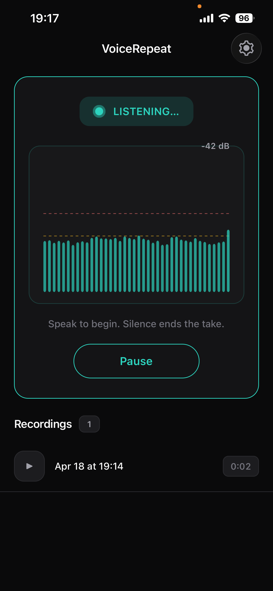

# ~VoiceMirror~ VoiceRepeat



## Prerequisites

- [mise](https://mise.jdx.dev/) — manages Node.js and pnpm versions

## Setup

```sh
mise trust
mise install
pnpm install
```

## Development

Start the dev server (requires the development build installed on your device):

```sh
pnpm start
```

## Type checking

```sh
pnpm run typecheck
```

## Builds (EAS)

| Command                      | Description                         |
| ---------------------------- | ----------------------------------- |
| `pnpm run build:dev:ios`     | Development build for iOS           |
| `pnpm run build:dev:android` | Development build for Android       |
| `pnpm run build:preview`     | Preview build for both platforms    |
| `pnpm run build:prod`        | Production build for both platforms |

Builds are run on EAS. You must be logged in:

```sh
npx eas-cli whoami        # check current login
npx eas-cli login         # log in
```

## Unit tests

```sh
pnpm test:ci
```

## E2E tests

E2E tests use WebDriverIO + Appium to drive the app on a real device (Android) or simulator (iOS). An in-app WebSocket bridge replaces the real microphone so tests can inject audio programmatically.

### Prerequisites

- Copy `.env.example` to `.env` and adjust the values for your setup.
- **iOS**: An iOS simulator matching the name in `.env` must be available.
- **Android**: A real Android device connected via USB (or `adb connect` over Wi-Fi) with USB debugging enabled. Run `adb devices` to confirm the device is listed.

### 1. Build the E2E binary

#### iOS (simulator)

```sh
pnpm run build:e2e:ios:local       # → artifacts/VoiceRepeat.app
```

#### Android (real device)

Set `EXPO_PUBLIC_E2E_WS_HOST` to your machine's LAN IP before building. This IP is baked into the APK so the app can connect back to the test runner's WebSocket bridge over the network.

```sh
# Find your LAN IP (macOS):
ipconfig getifaddr en0

# Set it in .env or export directly:
export E2E_WS_HOST=192.168.1.42

pnpm run build:e2e:android:local   # → artifacts/VoiceRepeat.apk
```

#### EAS (cloud)

```sh
pnpm run build:e2e:android
pnpm run build:e2e:ios
```

When using EAS, download the artifact and place it in `artifacts/`.

### 2. Run the tests

```sh
pnpm run e2e:ios
pnpm run e2e:android
```

For Android, make sure:

- The device and host machine are on the same LAN.
- The host firewall allows inbound connections on port 9876 (the WebSocket bridge).
- Optionally set `E2E_ANDROID_UDID` in `.env` to the device serial (from `adb devices`) if multiple devices are connected.

To run a specific test case:

```sh
pnpm run e2e:ios --mochaOpts.grep "partial swipe reveals delete button"
```

## Register a device (iOS internal distribution)

```sh
pnpm run device:register
```

Open the URL or scan the QR code on the target iPhone to install the registration profile.
